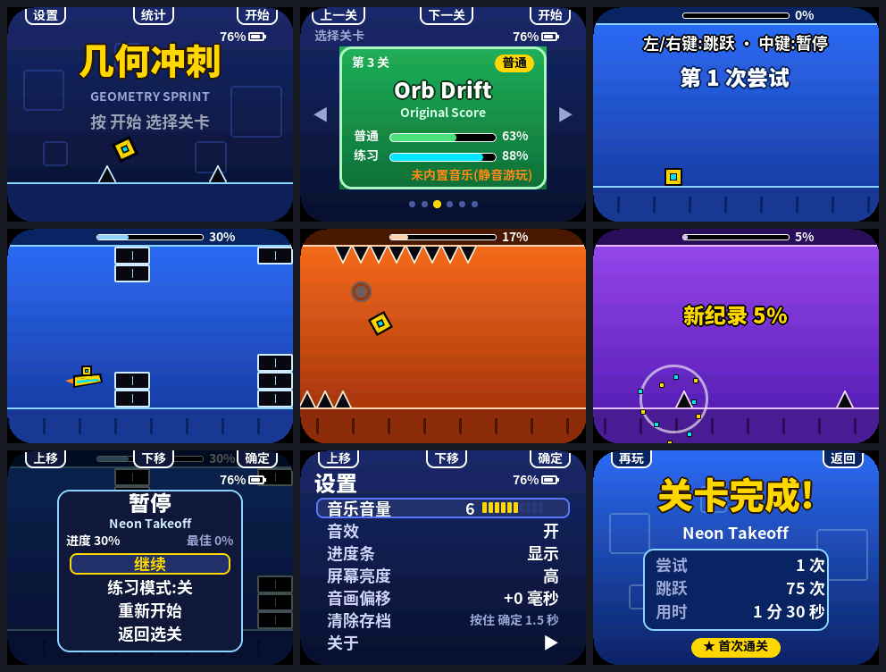

<p align="right">
  <a href="README.zh_CN.md">简体中文</a> · <strong>English</strong>
</p>

# Geometry Sprint

Turn the FoloToy AI Passport sideways and it becomes a pocket rhythm runner. The game is a tribute to
*Geometry Dash*: a cube dashes forward to the music and your only job is to **jump**. Clear spikes, hit jump
pads, tap jump orbs, fly a ship, and flip gravity; when you die you restart instantly until the level reaches
100%. Six original levels, fully offline.

<p align="center">
  
</p>

> The screenshots are rendered on a computer with the real LVGL by `tools/render_gd_preview.py`; colors and
> refresh on the device may differ. This is an unofficial tribute; "Geometry Dash" is a trademark of RobTop Games.

Requirements and acceptance criteria are in the [PRD](docs/geometry-dash-prd.md). The in-app interface is Chinese.

## Grip and controls

Hold the device sideways with the **three side keys on top** (rotate it 90° counter-clockwise, lanyard hole on the
left). From left to right the top edge holds **UP / DOWN / OK** (called the left / middle / right key below).
Small labels at the top of every menu page line up with the physical keys; they are hidden during gameplay.

| Page | Left key | Middle key | Right key |
| --- | --- | --- | --- |
| Title | Settings | Statistics | Start (level select) |
| Level select | Previous level | Next level | Click to start; long press returns to title |
| Gameplay | Jump / fly, hold to keep jumping | Pause | Jump / fly, hold to keep jumping |
| Practice mode | Jump / fly | Press places a checkpoint; long press pauses | Jump / fly |
| Pause menu | Move up | Move down | Select; long press = resume |
| Results | Play again | — | Back to level select |
| Settings | Move up (decrease when editing) | Move down (increase when editing) | Enter / confirm; long press goes back |

## Six levels

| # | Level (track) | Difficulty | New mechanic |
| --- | --- | --- | --- |
| 1 | Neon Takeoff | Easy | Cube jumps, platforms, the first ship section |
| 2 | Pad Runner | Easy | Yellow jump pads |
| 3 | Orb Drift | Normal | Yellow jump orbs, orb chains |
| 4 | Upside Dune | Normal | Gravity portals, blue jump orbs |
| 5 | Base Breaker | Hard | Triple spikes, blue jump pads, gravity flips |
| 6 | Final Pulse | Hard | Combined: orb chains, gravity switches, narrow ship corridors |

Each level lasts about 90 seconds, with obstacles choreographed to its track's beat. A host solver proves every
level can be completed and measures the timing window of every jump: the narrowest is 141 ms on easy, 54 ms on
normal, and 58 ms on hard levels (medians 150–250 ms).

- **Practice mode**: enable it in the pause menu. A checkpoint is placed automatically after 2 seconds of steady
  ground contact, and the middle key places one at any time; death returns to the latest checkpoint and the music
  resumes from the matching position. Normal and practice best progress are recorded separately.
- **Save data**: best progress, completion, attempts, jumps, total play time, and settings per level are kept in
  NVS and survive power loss.
- **Settings**: music volume (10 levels), sound effects, progress bar, screen brightness (3 levels), audio offset
  (±100 ms), clear save data (hold OK for 1.5 seconds), and About.

## Original soundtrack

All six pieces are original: `tools/gd_music_synth.py` composes and synthesizes them from the parameters in
[`assets/levels/tracks.json`](assets/levels/tracks.json) (BPM and first beat match each level, plus mode, chord
progression, timbre, and random seed), with electronic drums, bass, lead melody, arpeggios, and pads arranged as
intro, verse, drop, and break. Death, completion, checkpoint, and menu sounds are synthesized on the device.

```bash
python3 tools/gen_gd_music.py
```

It needs numpy. It encodes the six pieces as 16 kHz mono IMA-ADPCM in `build/gd_music/gd_music.bin` (about 4.58 MB,
73% of the music partition); add `--wav-dir <dir>` to also export WAV files for listening. The next firmware build
writes the pack to the `music` partition and merges it into the full image; without a pack the build still succeeds,
the game runs silently, and level cards show a no-music notice.

## Build, test, and flash

An activated ESP-IDF 5.5.3 environment is required (see [environment setup](docs/development/engineering/environment-setup.md)).

```bash
./tools/validate.sh
```

The complete gate covers repository checks, all host tests (physics, session, level completion proofs, music pack
and sound effects, save data and state machine, play controller, fonts and toolchain), the firmware build, and
merged-image verification. Flash `build/FoloToy-AI-Passport-full.bin` at `0x0`:

```bash
python -m esptool --chip esp32c3 -p <port> -b 460800 write-flash 0x0 build/FoloToy-AI-Passport-full.bin
```

Partition layout: the `factory` app has 2 MB (`0x10000`) and the `music` data partition about 5.94 MB
(`0x210000`). A merged flash overwrites NVS and resets saved progress and settings; see the
[flashing and data notes](docs/development/engineering/firmware-layout.md#flashing-and-stored-data).

## Development aids

| Command | Purpose |
| --- | --- |
| `python3 tools/gen_gd_levels.py generate` | Level ASCII → `main/gd_levels_data.c`, plus solver replays in `main/gd_replays_data.c` |
| `python3 tools/gen_gd_levels.py ruler` | Rewrite the beat rulers in the level files from BPM and first beat |
| `python3 tools/gen_gd_levels.py render` | Render each level as a long PNG (`build/levels/`) |
| `python3 tools/render_gd_preview.py` | Render every page with the real LVGL on the host and auto-play all six levels; checks that partial refresh matches a full redraw pixel for pixel, reports the LVGL pool peak and the pixels pushed per frame |
| `python3 tools/gen_gd_fonts.py generate --lv-font-conv … --font-dir …` | Regenerate the Chinese font subsets after editing `main/gd_strings.h` |
| `GD_AUTOPLAY=1 ./tools/validate.sh --firmware` | Build auto-play debug firmware: it plays the solver replays and logs a `perf` line every second over serial (frame rate, refresh time, heap, audio underruns) |

The level file format is described in `tools/gen_gd_levels.py`. Physics constants live in `main/gd_level.h`;
run `generate` after changing them (the gate checks that the replays are up to date).

## Code layout

| File | Content |
| --- | --- |
| `main/gd_level.*`, `gd_sim.*`, `gd_game.*` | Coordinates and physics constants, 240 Hz integer fixed-point physics and collision, one run's session (input queue, catch-up, attempts, practice checkpoints) |
| `main/gd_play.*` | Play controller: song clock → physics, death restart, completion, statistics (portable C shared by firmware and preview) |
| `main/gd_model.*`, `gd_save.*` | Page navigation and menu state machine, save format |
| `main/gd_mpack.*`, `gd_sfx.*` | Music pack format and IMA-ADPCM decoding, sound-effect synthesizer |
| `main/gd_gfx.*`, `gd_ui*.c`, `gd_theme.h`, `gd_strings.h`, `gd_fonts.*` | Immediate-mode canvas and dirty rectangles, pages, palette, UI text, and the font self-check |
| `main/gd_audio.*`, `gd_music.*`, `gd_store.*`, `gd_app.*`, `main.c` | Audio task and song clock, music partition, NVS, application task, and entry point (ESP-IDF) |
| `assets/levels/` | Six original levels, the track map, and the generation manifest |
| `components/bsp` | Adds `bsp_lvgl_set_orientation()`, the side-key position table, the `BSP_BTN_RELEASE` event, and the audio DMA constants |

The firmware compiles only `main.c` and `gd_*.c` and boots straight into the game; the baseline `demo_*.c` test
pages stay in the repository for host tests but are not built into the firmware.

## Verification status

- Passed: `./tools/validate.sh --static` (all host tests) and `./tools/validate.sh --firmware` (app 860 KB of 2 MB,
  merged image with the music pack 6.74 MB).
- Host preview: all six levels auto-play to completion; partial refresh differs from a full redraw by 0 pixels;
  LVGL pool peak about 9 KB of 40 KB; gameplay pushes about 33% of the screen's pixels per frame on average.
- Device test: on 2026-10-07 the developer flashed the delivered merged image (SHA-256 `b2094002…be6437`) and
  tested it on the device; the result passed.
- The firmware with the original soundtrack (only the music pack, level names, and About text changed) has not
  been listened to on the device yet.
- Still not covered: the device test was an overall acceptance, so the serial `perf` figures (frame rate, memory,
  audio underruns) were not recorded item by item; the keys-at-bottom landscape orientation
  (`BSP_LVGL_LANDSCAPE_KEYS_BOTTOM`) is unused by this app and not verified on hardware.
